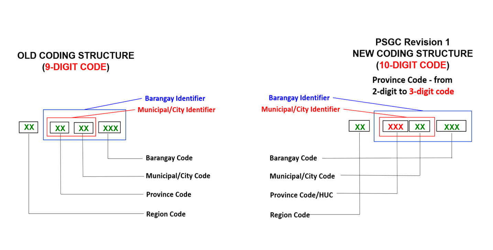

# Philippines PSGC Administrative Boundaries Shapefiles

Philippine PSGC administrative boundaries shapefiles.

This repository contains Philippine Standard Geographic Code (PSGC) vector maps (shapefiles) sourced from
public data and updated with changes published by the Philippine Statistics Authority (PSA). The dataset is updated to reflect all [PSGC Summary of Changes](https://psa.gov.ph/classification/psgc).


#### 📣 *This repository uses [`git-lfs`](https://git-lfs.com/) to store the shapefiles. Clone this project to download the files.*
```bash
$ git clone https://github.com/altcoder/philippines-psgc-shapefiles.git
Cloning into 'philippines-psgc-shapefiles'...
remote: Enumerating objects: 240, done.
remote: Counting objects: 100% (238/238), done.
remote: Compressing objects: 100% (168/168), done.
remote: Total 240 (delta 65), reused 225 (delta 60), pack-reused 2
Receiving objects: 100% (240/240), 9.46 MiB | 7.55 MiB/s, done.
Resolving deltas: 100% (65/65), done.
Filtering content: 100% (26/26), 3.34 GiB | 35.87 MiB/s, done.

$ cd philippines-psgc-shapefiles && ls dist
PH_Adm1_Regions.csv        PH_Adm2_ProvDists.csv      PH_Adm3_MuniCities.csv     PH_Adm4_BgySubMuns.csv
PH_Adm1_Regions.shp.zip    PH_Adm2_ProvDists.shp.zip  PH_Adm3_MuniCities.shp.zip PH_Adm4_BgySubMuns.shp.zip
```


The administrative level shapefiles updated as of [31 December 2023](https://psa.gov.ph/system/files/scd/PSGC-4Q-2023-National-and-Provincial-Summary.xlsx).


| WGS84 ESRI Shapefile | Description |
| --- | --- |
| **[PH_Adm1_Regions.shp.zip](dist/PH_Adm1_Regions.shp.zip)** | Level 1: Regions |
| **[PH_Adm2_ProvDists.shp.zip](dist/PH_Adm2_ProvDists.shp.zip)** | Level 2: Provinces and Districts |
| **[PH_Adm3_MuniCities.shp.zip](dist/PH_Adm3_MuniCities.shp.zip)** | Level 3: Municipalities and Cities |
| **[PH_Adm4_BgySubMuns.shp.zip](dist/PH_Adm4_BgySubMuns.shp.zip)** | Level 4: Barangays and Sub-Municipalities |

## Changelogs

List of changes that were reflected on the datasets.
- ❌ *"Pending"* - Changes haven't been applied in the dataset.
- ✅ *"Updated"/"No Change"* - The PSGC changes in the reported period have been applied in the dataset.


| PSGC Updates      | Date | Status |
| :---------------- | :------ | ----: |
| [No Change in the Fourth Quarter 2023 PSGC](https://psa.gov.ph/classification/psgc/node/1684061953) | January 23, 2024 | ✅ (NC) |
| [Third Quarter 2023 PSGC Updates: Conversion to a New City, Merging of 44 Barangays, Renaming of Five Barangays, Transferring of 10 Barangays, and Correction of the Names of 12 Barangays](https://psa.gov.ph/classification/psgc/node/1684061390) | October 24, 2023 | ✅ |
| [Second Quarter 2023 PSGC Updates: Correction of the Names of One Municipality and 35 Barangays](https://psa.gov.ph/classification/psgc/node/1684060569) | August 15, 2023 | ✅ |
| [First Quarter 2023 PSGC Updates: Six New Barangays and Correction of the Names of One Municipality and Four Barangays](https://psa.gov.ph/classification/psgc/node/176698) | April 18, 2023 | ✅ |
| [Fourth Quarter 2022 PSGC Updates: Conversion to a New City, Merging of 28 Barangays, Renaming of a Barangay, and Correction of the Names of 19 Barangays](https://psa.gov.ph/classification/psgc/node/168704) | January 25, 2023 | ✅ |
| [Third Quarter 2022 PSGC Updates: Division of the Province of Maguindanao, Conversion of One (1) Municipality into New City, Creation of One (1) Barangay, and Correction of the Names of 44 Barangays](https://psa.gov.ph/classification/psgc/node/168321) | November 8, 2022 | ✅  |
| [First Quarter 2022 PSGC Updates: Correction of the Names of Five Barangays](https://psa.gov.ph/classification/psgc/node/167762) | April 29, 2022 | ✅ |
| [Fourth Quarter 2021 PSGC Updates: Correction of the Names of 35 Barangays](https://psa.gov.ph/classification/psgc/node/166424) | March 22, 2022 | ✅ |
| [Third Quarter 2021 PSGC Updates: Inclusion of BARMM and Correction of Names of the 37 Barangays](https://psa.gov.ph/classification/psgc/node/166423) | March 22, 2022 | ✅  |
| [PSGC Second Quarter 2021 Updates: Correction of Names of 17 Barangays](https://psa.gov.ph/classification/psgc/node/164996) | August 19, 2021 | ✅ |
| [No PSGC Updates for the First Quarter of 2021](https://psa.gov.ph/classification/psgc/node/164487) | May 12, 2021 | ✅ (NC) |
| [PSGC Fourth Quarter 2020 Updates: Correction of Names of 10 Barangays](https://psa.gov.ph/classification/psgc/node/163961) | February 16, 2021 | ✅ |
| [No PSGC Update for the Third Quarter of 2020](https://psa.gov.ph/classification/psgc/node/163593) | December 2, 2020 | ✅ (NC) |
| [No PSGC Update for the Second Quarter of 2020](https://psa.gov.ph/classification/psgc/node/163076) | September 8, 2020 | ✅ (NC) |
| [First Quarter 2020 PSGC Updates: One New Barangay Created and The Names of Two Barangays Corrected](https://psa.gov.ph/classification/psgc/node/161871) | May 5, 2020 | Updated |
| [PSGC 4th Quarter 2019 Updates: Compostela Valley is now Davao de Oro](https://psa.gov.ph/classification/psgc/node/145095)| January 23, 2020 | ✅ |
| [Third Quarter 2019 PSGC Updates: Conversion of Sto. Tomas into a City and Correction of Name of Bgy. Lt. Balag](https://psa.gov.ph/classification/psgc/node/144645) | November 15, 2019 | ✅ |
| [No PSGC Update for the 2nd Quarter of 2019](https://psa.gov.ph/classification/psgc/node/138937) | July 16, 2019 | ✅ (NC) |
| [No PSGC Update for the 1st Quarter of 2019](https://psa.gov.ph/classification/psgc/node/138550) | May 2, 2019 | ✅ (NC) |
| [No PSGC Update for the 4th Quarter of 2018](https://psa.gov.ph/classification/psgc/node/137060) | January 11, 2019 | ✅ (NC) |
| [Third Quarter 2018 PSGC Updates: New Barangay Created; Name of Municipality Corrected](https://psa.gov.ph/classification/psgc/node/136072) | October 12, 2018 | ✅ |
| [The Municipality of Bumbaran in the Province of Lanao del Sur is now Municipality of Amai Manabilang](https://psa.gov.ph/classification/psgc/node/134410) | July 13, 2018 | ✅ |
| [12 New Barangays Established in the First Quarter of 2018](https://psa.gov.ph/classification/psgc/node/131336) | April 24, 2018 | ✅ |
| [No PSGC Update for the 4th Quarter of 2017](https://psa.gov.ph/classification/psgc/node/129320) | January 12, 2018 | ✅ (NC) |
| [PSGC 3rd Quarter 2017 Updates: Abolition of the Negros Island Region (NIR)](https://psa.gov.ph/classification/psgc/node/127925) | October 27, 2017 | ✅ |
| [No PSGC Updates from April 01 to June 30, 2017](https://psa.gov.ph/classification/psgc/node/126423) | July 14, 2017 | ✅ (NC)|
| [No PSGC Updates from January 1 – March 31, 2017](https://psa.gov.ph/classification/psgc/node/116178) | April 6, 2017 | ✅ (NC) |
| [No PSGC Updates from October 1 - December 31, 2016](https://psa.gov.ph/classification/psgc/node/70242) | January 16, 2017 | ✅ (NC) |
| [PSGC 3rd Quarter Updates: MIMAROPA Region, City of Ozamiz, and Barangay Hañib](https://psa.gov.ph/classification/psgc/node/63723) | October 21, 2016 | ✅ |
| [No Philippine Standard Geographic Code (PSGC) Updates for the First Quarter of 2016](https://psa.gov.ph/classification/psgc/node/55142) | April 14, 2016 | ✅ (NC) |
| [Seven New Barangays Established In the 3rd Quarter of 2015](https://psa.gov.ph/classification/psgc/node/51291) |   October 28, 2015   | ✅ |

## Conventions

PSGC PSA's new 10-digit coding structure and stored as numeric format.



For convenience, parent PSGC codes are also stored in the datasets. This can be useful when joining across administrative levels.

## Source Files

Maps are using EPSG:32651, Lat/Long projection.

The 2023 Level 0 to 4 raw shapefiles came from [OCHA Services Website](https://data.humdata.org/dataset/cod-ab-phl). This dataset was cleaned up and matched with the most recent PSGC codes and location names. The shapefile was also updated to reflect merging of locations.

### Old Sources
If you are using an older version of this project (2019) the source data for that uses:

The 2015 Level 0 to 3 shapefiles came from [OCHA Services Website](https://data.humdata.org/dataset/philippines-administrative-levels-0-to-3) (Not Available Anymore).

The 2015 Level 4 shapefiles came from [this Github Repo](https://github.com/justinelliotmeyers/official_philippines_shapefile_data_2016)

The 2011 Level 0 to 4 shapefiles came from [GADM Website Data](https://gadm.org)

Please refer to the [PSGC Summary of Changes](https://psa.gov.ph/classification/psgc)
to take into account potential issues that may arise when using these maps together with your datasets.

## Contributing

Contributions are always welcome, no matter how large or small. Before contributing,
please read the [code of conduct](./.github/CODE_OF_CONDUCT.md).

Kindly report data errors by filing issues.
